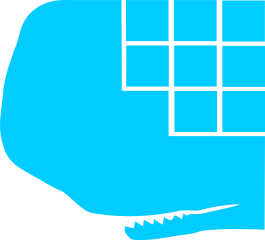

<!-- ALL-CONTRIBUTORS-BADGE:START - Do not remove or modify this section -->

<!-- ALL-CONTRIBUTORS-BADGE:END -->
# Bahamas Marine Mammal Research Organization (BMMRO)

## Overview
Bahamas Marine Mammal Research Organization (BMMRO) is not just a mouthfull, but is also a non-profit scientific research organisation run by world renowned scientists finding marine mammals in and around Abaco Island, Bahamas, understanding their primary areas of habitation and using what they learn to make a difference. This page is here because we believe technology can help them better than it currently is. Join us...

## About them
- Website:	 http://www.bahamaswhales.org/home.aspx
- Facebook: 	www.facebook.com/BMMRO
- Twitter: 	[@BMMRO](https://www.instagram.com/bmmro/)
- Instagram: 	[@BMMRO](https://twitter.com/BMMRO)
- [Publications](https://bit.ly/35cssEW)

## About us
We are passionate about technology. We understand that the system that protects us, doesnt protect all. We are a subsystem within a system that reaches out to correct the problems caused by the system, which we are part of. Its complicated.

## Mission
- Build software to enable and improve BMMRO's mission
- Be a technical consultant to BMMRO

## Philosophy
- Thin vertical slices
- Add automated tests, if it builds we ship it
- ... (suggest more)

## Onboarding Pathway
- [Intro Video](https://drive.google.com/drive/u/1/folders/19epArmIPsgr5Tb2omchZ1ttjHHbw5AQo)
- [Current “As Is” infographic](As%20Is%20InfoGraphic.png)
- [Habitiat Use Data Sheet, example of the most frequently used form on boat excurtions](HabitatUseDataSheet.JPG)
- [Encounter Sighting Data Sheet](EncounterSightingDataSheet.JPG)
- [Kanban board](https://github.com/JBJamesBrownJB/BMMRO/projects/1)

## Milestones
- ✅**Inception**
- ✅**As-is inforgraphic**
Gather information about the current “as-is” technology and processes being used
- 🚦**HUDS** (Habitat Use Data Sheet)
Build an application to improve the data gathered about habitats whilst researchers are on boat surveys. By the end of this milestone, they should be using a browser based UI (PWA?) to gather data for habitats from typical consumer devices (smart phones, pads, laptops), it should be stored securely on the cloud and accessible to export for use in their current R based analytics workflow
- 🚦**ESDS** (Encounter Sighting Data Sheet)
This will extend the application to enable capturing encounter data when marine wildlife is sighted on boat trips
- 🚦**Data Migration Tool**
This will provide a tool to migrate data from their current MS Access database to the new data store. It should be idempotent to allow for multiple migrations without data corruption or duplication and thus allowing old and new world to co-exist
- 🚦**Media Link**
Research, incept and build on the existing system to allow their extensive collection of media (images, video, audio) data can be linked, in a meaningful way, to the HUDS and ESDS data. Look for opportunities to improve the gathering of this data along the way
- 🚦**TBC**
Potential future work could be further app improvements, more accessible or sophisticated data analysis, website improvements, integrating data into their website.

# Documents and repositories: 
[Google drive](https://bit.ly/34ha4dK)
... If you do not have access to any of the above, email siva.subramanian@thoughtworks.com or james.brown@thoughtworks.com

# Inspiration
- https://www.flukebook.org/
- https://patternradio.withgoogle.com/

## Primary Contacts:
- James Brown, Technical Lead (TW): james.brown@thoughtworks.com / jameskinnahbrown@gmail.com
- Charlotte Dunn, PhD (BMMRO):  cdunn@bahamaswhales.org
- Thomas Brown, client Product Owner (BMMRO): motnworb@hotmail.com
- Siva Subramanian, Technical Lead (TW): siva.subramanian@thoughtworks.com 
- Team: bahamas-marine-mammal-research-organization@thoughtworks.com

## Contributors ✨

Thanks goes to these wonderful people ([emoji key](https://allcontributors.org/docs/en/emoji-key)):

<!-- ALL-CONTRIBUTORS-LIST:START - Do not remove or modify this section -->
<!-- prettier-ignore-start -->
<!-- markdownlint-disable -->
<table>
  <tr>
    <td align="center"><a href="http://www.bogwell.co.uk"> <b>James Brown</b></a> <a href="https://github.com/BMMRO-tech/BMMRO/commits?author=JBJamesBrownJB" title="Code">💻</a> <a href="#projectManagement-JBJamesBrownJB" title="Project Management">📆</a></td>
    <td align="center"><a href="https://github.com/gazeddyw"> <b>Gareth Williams</b></a> <a href="https://github.com/BMMRO-tech/BMMRO/commits?author=gazeddyw" title="Code">💻</a></td>
  </tr>
</table>

<!-- markdownlint-enable -->
<!-- prettier-ignore-end -->
<!-- ALL-CONTRIBUTORS-LIST:END -->

This project follows the [all-contributors](https://github.com/all-contributors/all-contributors) specification. Contributions of any kind welcome!